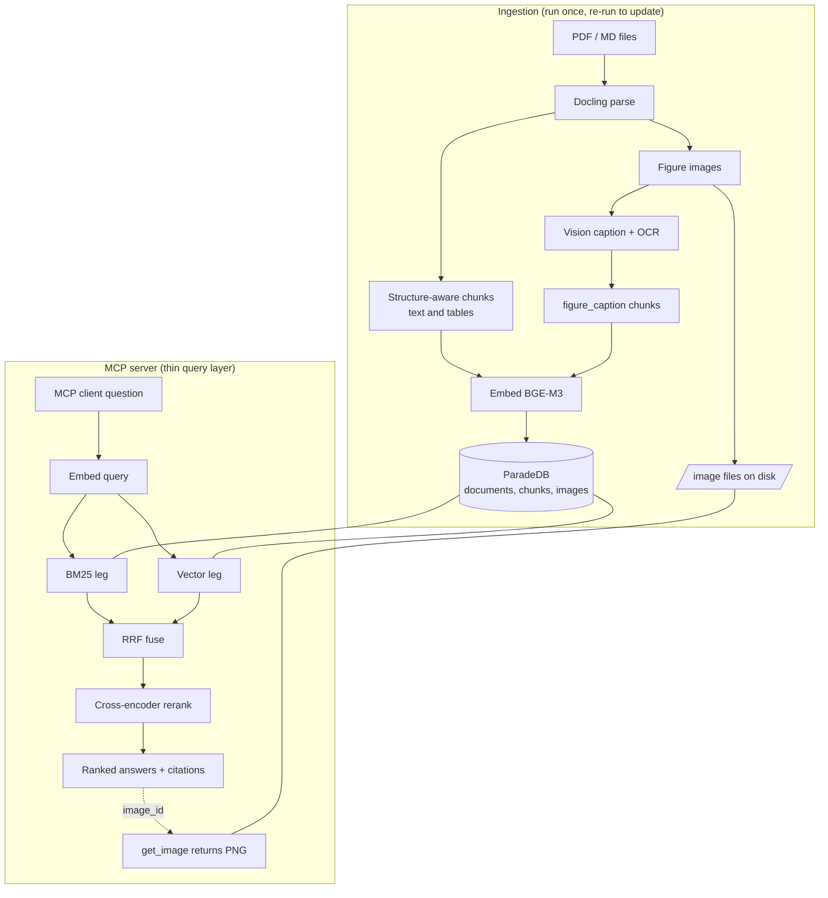

# Architecture and Plan

Bottom line. This project ingests a folder of product PDFs into a single free
backend (ParadeDB, which is Postgres with BM25 and pgvector built in), then
serves accurate, version-aware answers over the Model Context Protocol. It runs
one of two ways from the same image. Local and open on a laptop, or remote
behind a Cloudflare Tunnel where every caller needs a per-user service token and
every remote call is logged. Figures and diagrams are extracted, captioned, and
kept, so the server can hand them back for inclusion in output.

Everything in the stack is free and self-hostable.

---

## Design goals (from the brief)

1. Local, free, Docker-deployable MCP server.
2. Remote access through a Cloudflare Tunnel, gated by a Cloudflare Access
   service token, with the option to also run purely locally.
3. Highest practical retrieval accuracy.
4. A hybrid (semantic plus lexical) search backend, or a knowledge graph that
   has hybrid search in it.
5. Extract text from graphics and photos, and also keep the images so they can
   be returned in output.
6. Shareable on GitHub with a README anyone can follow.
7. Add users and issue service tokens for remote use, no token for local use,
   and log all remote use.

## The corpus this was shaped around

Roughly 150 Cisco Secure Email / Content Security PDFs. Many are 19 to 20 MB
Admin Guides and User Guides repeated across AsyncOS 13.0 through 16.5, plus CLI
and API references, release notes, hardware installation guides full of rack
diagrams, port photos, and LED tables, data sheets, and a large set of short
how-to and troubleshooting articles.

Two properties of this corpus drove the design.

- **Version sprawl.** The same procedure exists in a dozen versions. A correct
  answer depends on returning the right version, so every chunk is tagged with
  product, version, and doc type, and those tags are filters at query time. This
  is the single biggest accuracy lever here.
- **Diagram-heavy hardware and design docs.** Port layouts, topologies, and LED
  status tables live in figures. Those are parsed, described, transcribed, and
  stored, not dropped.

---

## Why this stack

| Concern | Choice | Why |
|---|---|---|
| Backend | **ParadeDB** (Postgres + `pg_search` BM25 + `pgvector`) | One free container gives lexical BM25, dense vectors, metadata filters, and SQL in one place. No separate vector DB or search cluster. It is the same spine used before for the DLP docs, so it is proven. |
| Retrieval | **Hybrid + Reciprocal Rank Fusion + cross-encoder rerank** | Hybrid catches both exact strings (CLI commands, error codes) and meaning. Reranking is the largest accuracy gain per unit effort. |
| Embeddings | **BGE-M3** (1024-dim), swappable | Strong accuracy, permissive license, runs on CPU for a bounded corpus and faster on a GPU. |
| Reranker | **bge-reranker-v2-m3**, swappable | Free cross-encoder, CPU-friendly, big precision lift. |
| Parsing | **Docling** | Free, layout-aware. Keeps tables and extracts figure images with page provenance. |
| Figures | **Docling image export + a local vision model (Ollama) + OCR** | Diagrams and screenshots become searchable text, and the original PNG is stored for reuse. |
| MCP server | **FastMCP** (streamable HTTP) | Free, current, works locally and behind a tunnel, returns images natively. |
| Remote access | **Cloudflare Tunnel + Access service tokens** | No inbound ports. Per-user tokens. Free Zero Trust tier covers this. |

### On the "knowledge graph instead" option

The brief allowed a knowledge graph that has hybrid search in it. For this
corpus the hybrid-plus-rerank path was chosen as the primary engine because the
questions are overwhelmingly "what is the setting or command for X in version Y,"
which reward precise passage retrieval more than graph traversal. A graph adds
real cost at ingest time (LLM entity and relation extraction over 150 large
PDFs) for uncertain gain on those questions. The graph is kept as an optional
Phase 2 layer (see the roadmap) for relationship and multi-hop questions, and it
would sit alongside this backend rather than replace it.

---

## Data flow

Ingestion and serving are deliberately separate. Ingestion populates the
backend and is where heavy models can run (point it at a GPU box for a
max-accuracy index build). The MCP server is a thin query layer over the
populated backend, light enough to run anywhere. Rebuilding or upgrading the
index never touches the serving contract.

## Storage model

Three tables in Postgres.

- `documents` is one row per source file, with product, version, doc type,
  title, page count, and a sha256 for incremental re-ingest.
- `chunks` are the retrievable units. Each has content, a `content_type` of
  `text`, `table`, or `figure_caption`, a section path, a page range, the
  denormalized product/version/doc type for fast filtering, an optional
  `image_id`, and a dense `embedding`. A BM25 index and an HNSW vector index
  both cover this table.
- `images` are the extracted figures. The PNG is kept on a disk volume, and the
  row holds the caption, the OCR/transcription text, dimensions, and page.

Figures are searchable because each one also produces a `figure_caption` chunk
whose text is the caption plus the vision-model description and transcription.
A search hit on that chunk carries the `image_id`, and `get_image` returns the
stored PNG for inclusion in output.

---

## Deployment modes

### Local, open

`docker compose up -d --build` starts ParadeDB and the MCP server. The server
binds to `127.0.0.1` only and requires no token. This is the private,
single-machine install.

### Remote, authenticated

Set `AUTH_MODE=cloudflare` and the Cloudflare values, then
`docker compose --profile tunnel up -d --build` adds the `cloudflared`
connector. There are no inbound ports. Cloudflare Access sits in front of the
public hostname and requires a service token, and the server independently
verifies the Access JWT so a direct hit on the origin is still rejected.

## Security and access model

- **Local mode.** No authentication, localhost binding only.
- **Remote mode.** Cloudflare Access gates the hostname with a Service Auth
  policy. Each user gets their own service token (a Client ID and Secret sent as
  `CF-Access-Client-Id` and `CF-Access-Client-Secret` headers). Cloudflare
  injects a signed `Cf-Access-Jwt-Assertion` header, and the server verifies it
  against the team's public keys, checks the audience tag, maps the token to a
  named user in `config/users.yaml`, and rejects anything unknown or disabled.
- **Adding a user** is creating a service token and registering it, either in
  the Cloudflare dashboard or with `scripts/add_user.py`. Removing access is
  disabling the entry or revoking the token in Cloudflare.
- **Logging.** Every remote request and every tool call is written as a JSON
  line to `data/logs/audit.log` (rotated) and to stdout, with the user identity,
  tool, filters, result count, source IP, status, and latency. This is a copy
  you control, independent of Cloudflare's own Access logs.

The auth and logging live in a pure-ASGI middleware so they do not interfere
with MCP's long-lived streaming responses.

---

## Accuracy strategy (summary)

1. Version-aware metadata filtering so the right edition is returned.
2. Hybrid retrieval so exact strings and meaning both land.
3. Cross-encoder reranking on the fused candidates.
4. Structure-aware chunking that keeps tables and headings intact.
5. Figures turned into searchable, transcribed text.

Full detail and tuning knobs are in [ACCURACY.md](ACCURACY.md).

## MCP tools

| Tool | Purpose |
|---|---|
| `search_docs` | Hybrid search with optional product, version, and doc-type filters. |
| `list_products`, `list_versions`, `list_doc_types` | Discover filter values so callers scope correctly. |
| `get_context` | A chunk plus its neighbours for more surrounding text. |
| `get_image` | Return an extracted figure (PNG) for display or reuse. |
| `get_image_info` | A figure's caption, transcription, and citation. |
| `corpus_stats` | Document, chunk, and image counts. |

## Roadmap

- **Phase 2, optional knowledge-graph layer.** Extract entities (appliances,
  features, CLI commands, settings, versions) and relations into a graph
  (LightRAG or Neo4j Community) that sits beside ParadeDB, for multi-hop and
  relationship questions. Vector and BM25 retrieval stay the default path.
- **Evaluation harness.** A small labelled question set and a scored run so
  changes to models or tuning can be measured, not guessed.
- **Multimodal image search.** Optional true image-similarity retrieval with a
  multimodal embedder, on top of the caption-based figure search that ships now.
- **Incremental scheduler.** A periodic re-ingest so new release notes and
  articles are picked up automatically.
